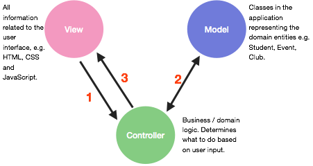
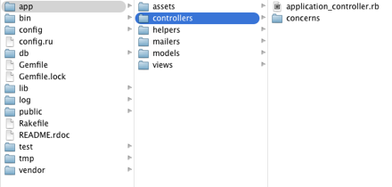

# Ruby On Rails
## Week 1
This workshop will focus on getting you familiar with the Rails environment by giving you an overview of the MVC pattern, then teaching you  how to create a view, model and controller using Rails. It will then proceed to cover the ActiveRecord relations (for database management), routing for incoming requests and form validation. We will then cover some basics of web design and integrating third party frameworks. We will then use this knowledge to create a light-weight blogging application.

Before we get started, ensure that you have rails successfully installed, run the command:
```bash
  rails -v
```

Ensure that it returns Rails 4.0.x where x is any number (it doesn’t matter as long as you have rails 4 installed).

###Model, View, Controller : The MVC Pattern. 

Model-View-Controller or MVC is a software pattern heavily utilised in applications requiring a user interface. While MVC is most commonly referred to in relation to web application development (in frameworks such as ASP.NET, Django, WebObjects and as you might have guessed, Ruby on Rails), it is also used to structure iOS applications. 

MVC separates the internal representation of information from the way that information is presented to the end user. An application structured according to MVC separates its functionality into the three areas described below.

####Models

The model contains the representation of data from the domain in question. In general, the model works with data from a database. If you are familiar with the concept of Object Relational Mapping (ORM), you can consider the model as the collection of classes that map to database tables. For example an Event model could be a Ruby class that represents an event and would contains methods to set / update its data (e.g. name, date, club, description) and takes care of persistence to the underlying database. 

####Controllers

Controllers can be considered the middle men of an application. Controllers take input and commands from users and then interact with the model according to application logic.  For example a controller may receive a user command to run a search for all students who have purchased tickets to a particular event. It is the controllers job to determine which models need to be queried (in this case possibly Event and Student) and then which view to display back to the user. 

####Views

When the controller wishes to display information to the user, it does so using a particular view. Views contain all information related to layouts, themes, markup, etc. In the case of a web application, a view is implemented as HTML, CSS and JavaScript.  

An application structured according to MVC achieves a strong separation of concerns. For example, there is no need for the model to know anything about how its contents might eventually be displayed to the user. Likewise the view need not contain any information related to databases or application logic.



The user triggers some action by interacting with a view in a web browser. For example this may occur when a user fills out a form and clicks on submit. This is sent to the controller in the form of a HTTP `GET` or `POST` request.
The controller receives the input, determines what it needs to do and interacts with the appropriate models. This may involve updating or deleting the information in a model or simply retrieving it.
The controller displays information back to the user in an appropriate view (e.g. an event information page or a search results page).

#### Exercise One - Core

Consider a request by a user to perform a search for events by a particular club between particular dates. Answer the following questions 

- What sort of information flows from user (in the form of a HTTP request) to the controller? 
- What kind of functionality might reside in the controller? What kinds of models might the controller interact with? 
- What might the view look like that is displayed back to the user by the controller?

### How a Rails Application Works

When running the Rails server, it is important to understand exactly what is happening underneath so we have a solid foundation to build our knowledge of Rails upon. The Rails server provides several layers of abstraction in allowing you to develop your website, it takes care of a lot of the low level handling and leaves us with an elegant system of routes and controller actions.

When you access a rails website, for example www.somedomain.com, this will send a request for the route for ‘root’ to the rails server. Rails will then look up it’s routes.rb file, determine the appropriate controller and the approbate method, call that method on that controller and if applicable, compile the ‘.erb’ (embedded ruby) file to HTML, then serve that to the client that requested that resource. 

That basic pattern is repeated over and over for any interaction that the client has with your rails application. We outline it again here in a more concise generic example:

- The client sends a  `GET` request in the form of a url (this may also be a `POST` or `DELETE` request). 
- The rails server then matches that request against the routes.rb file, and determines the appropriate controller to send the request to and which method to call. 
- The method is then called and passed in any appropriate parameters, this allows us to do some computation before presenting the view (or to post information or delete information).
- The rails server then finds any appropriate view `.erb` files and compiles these into standard HTML, which is then served up to the clients web browser, completing the interaction. 

### Getting Started with Rails

Rails is a framework, built using Ruby, that allows us to develop web applications using a MVC architecture (or REST-full architecture, though we wont be covering that in this tutorial) in a fairly straightforward manner. It combines Ruby for the data and database manipulation with HTML, CSS and Javascript for the front-end development. To get started we will create a new rails application with the following command:  
```bash
  rails new $app_name
```
In use you would replace $app_name with the name of your application you wish to create. Rails will then go ahead and create a directory for your new application, then populate it with all of the files that are required to run a Rails web applications. To verify this worked cd into the directory and run the following command: 
```bash
  rails server
```
You should see a message notifying you that the rails server has started up on localhost. Open your web browser and navigate to http://localhost:3000/. You should see a default landing page. You are now up and running with rails. We will now go over the contents of the application that rails has created for you.





Here we see the basic folder structure of a Rails application. There are three folders that you will be primarily concerned with, ‘app’, ‘config’ and ‘db’. The ‘app’ folder contains all the ruby files for the model and controller as well as the .erb (embedded ruby) files for the views. We will go over these in more detail later in the workshop.

The ‘config’ folder contains files that indicate to the rails server what database will be used, how the application will send out emails and basic information like the time-zone the application is running in. Finally, the ‘db’ folder contains all of the database migrations and definitions that rails will use to instantiate the database at runtime. 

The contents of the other folders should not be changed until you become more familiar with the framework as you will likely cause more problems than you will solve. However, if you are interested in any particular aspect of this set up, feel free to ask your tutor. 

### Using Rails Through the Command Line

The majority of your interactions with the Rails framework will be through the command line. Rails relies on command line expressions to create models, views and controllers, as well as database manipulations and to then perform these database manipulations. 

Because of this you will need to be quite familiar with the command line. All the commands to generate models, controllers, database migrations etc.  are performed by first typing the ‘rails’ command. Following we list some of the most common rails commands and what their purpose is.

|     Command    |     Purpose    |
|:--------------:|:----------------------------------------------------:|
| rails generate | Generates new code for your application, this can be models, views, controllers or db migrations among other objects. |
|  rails console |            Starts the rails server and allows an interactive environment for debugging purposes (like IRB).           |
|  rails server  |                                                Starts the rails server.                                               |
|  rails destroy |                        The opposite of the generate command, used to remove particular objects         

### Creating Views and Controllers in Rails

There are two ways that you can set up views and controllers in Rails. The first method is to generate a scaffold. The command for this is as follows:
  
```bash
  rails generate scaffold NAME field_name:type 
```

Generating a scaffold generates an entire resource, including the model, database migration, controller and views (along with test suite). The name must be in singular form (i.e. Tweet, rather than Tweets) and should be followed by the fields you wish to include in the model/view/controller. For example if we wanted to scaffold a post we may do it as follows: 

```bash
  rails generate scaffold post contents:text user_id:integer
```

This will create a file in the models folder called ‘post.rb’, a folder in the views called ‘posts’ with .erb pages for standard RESTful processes and will create a controller called ‘posts_controller.rb’ in the controller folder. It will also generate blank files for css, javascript and for test cases and put these in the appropriate folders. 

The alternate method is to simply generate the controller by itself. The syntax for this is:
```bash
  rails generate controller NAME actions
```
Using this method does not generate a model, but will generate a controller with methods defined for any action you give it, as well as the basic .erb template files in the view folder that you can then fill in. An example use of this command would be: 

```bash
  rails generate controller posts_controller new destroy show index
```

This will create a controller file with blank methods for ‘new’, ‘destroy’, ‘show’, ‘index’ as well as creating the appropriate empty .erb files in the view folder. 

#### Exercise Two - In Class 
Try generating a scaffold and controller (with different names) and provide the controller with some actions as arguments. Have a look at the difference between the generated code, why is the scaffold able to do this?

### Creating Models in Rails

As discussed earlier, we can use the scaffold generation to create the model at the same time as we create the view and controller. This is useful when we want to create an object like a post, where we want to be able manipulate those posts and provide views for that. The other method however will not create the controller or view, and is useful in situations where the model will not require a view to directly access the data. This could include things like tickets for events or comments from pages which may be used in a wide range of views. 

Thankfully generating these is no more difficult than generating them with the scaffold command. Rails provides a method that allows us to create a model and provide parameters for the fields on that model, and it is used as shown below:

```bash
  rails generate model NAME field:type
```

You do not have to provide all of the fields when first getting started, you can add them later using database migrations, but it is useful to add those you know when beginning straight away as it allows you to get up and running more quickly. In creating models there are very specific ‘types’ that can be used in the field:type pairs. Rather than fill two pages with these, run the following command and read through the description as it will explain all of the different types of relations:

```bash
  rails generate model -h
```

The ‘-h’ argument, for those who aren’t familiar with unix commands, will print a help page for any given command. This also works for the scaffold and controller generators. In your own time, run each of these commands with the ‘-h’ argument and read through the output for a more thorough overview of the functionality of these commands. A lot of the options may seem confusing to you now, however you will come to be familiar with them as you use rails to develop your application.

### Database Migrations

Regardless of how you generate your model, either with the generate model or generate scaffold commands, you will have to run a database migration to integrate those changes with the existing database. When you create a model, Rails will generate a file, placed in ‘db/migrations’, that is responsible for creating the table and columns in the actual database. In order to apply these changes, you must run the command
```bash
  rake db:migrate
```
This will then integrate those changes into your schema and update your database file. Understanding how these database migrations work is incredibly important in order to update your models database representations after you have created them, or to remove fields after creation. You can generate a new database migration with the command: 
```bash
  rails generate migration NAME field_name:type
```
This will create a migration file and try to associate it to a model with the same name as you provide. If you then provide fields it will also add those to the migration. For example, the following would create a migration that adds the field ‘image_url’ as a string to a user class.
```bash
  rails generate migration AddImageToUser image_url:string
```

There are a wide range of options as to what rails will generate based on the names provided, and the best way to learn these is to learn the syntax, this would be a whole tutorial by itself so we encourage you to read the official guide to active record migrations located [here](http://guides.rubyonrails.org/migrations.html) by yourself in your own time. 

#### Using Active Record for Database Manipulation

To create the “model” in our MVC pattern Rails uses an abstraction layer built on Active Record to enable database flexibility. Active Record is in itself a design pattern, originally conceived by Martin Fowler, where objects contain persistent data, as well as methods or behaviours which operate on that data. Rails has been designed so that if you follow convention,  you will have to do very little work when creating your Active Record Models. 

By default, whenever you create a new Rails model, it will inherit the class `ActiveRecord::Base`. This is what allows the mapping of your class to the database instances. It also allows us to access the attributes in the database as if they were instance variables, with the @var notation inside the class and using attribute accessors and readers outside the class.  Active Record provides a very rich API for accessing data from a database, all of which is covered [here](http://guides.rubyonrails.org/active_record_basics.html). We will only be focussing on a small subset of these to get you up and running as quickly as possible. 

We create objects with the ‘new’ method as we would for a standard Ruby class. When we call new, the model will be created but not saved to the database. This doesn’t happen until we call the method “model.save”. Retrieving data is just as easy as creating it. If we had a student model class and wanted to find a student by email address, this would be as simple as: 
```ruby
  Student.find_by(email: ‘some_email@unimelb.edu.au’)
```
This will instruct the backend database to search the Students table for a student where the email field matches the string ‘some_email@unimelb.edu.au’. If we use database relations when creating our models, we can make finding related objects painless. Say we have a user class that is defined as follows: 
```ruby
  class Student < ActiveRecord::Base
    has_many :tickets
  end
```
And a ticket class defined as follows:
```ruby
  class Ticket < ActiveRecord::Base
    belongs_to :student
  end
```
If we then wanted to find all tickets belonging to a user, whose student id was 313241, we could do that as follows:
```ruby
  student = Student.find_by(id: 313241)
  tickets = student.tickets.all
```
This is only a small subset of what rails is capable of, for more of an overview on queries and associations visit: http://guides.rubyonrails.org/active_record_querying.html and http://guides.rubyonrails.org/active_record_querying.html respectively.

### Routing

Routes are how rails decides where certain actions are directed. They dictate what url corresponds to which action on which controller and therefore which view is presented. This may sound complex, and it’s true that there are complex rules you can apply to speed up performance here, but for the purposes of your project there isn’t too much to learn thankfully. 

Lets start with an example request:
```bash  
  GET /posts/11
```
Rails needs to know what to do with this, so we provide it a route it can understand and use whenever it gets a request that is similar, like so: 
```ruby
  get ‘/posts/:id’, to: ‘posts#show’
```
Lets take a look at what is happening here. First the keyword `get` indicates it matches a `GET HTTP` request, followed by the url expression. Notice we have used the symbol :id, to indicate that 11 will be passed in as the value of the variable id. We then see the `to:` method which takes a controller (posts) and calls the method show with `{ id: 11 }` as the parameters. 

The general pattern is as follows:
```ruby
  request_type ‘url’, to: ‘controller#method’ as: :route_name
```

Where `request_type` can be any of the standard HTTP request types, the url is the input expected, which can include symbols to be passed as params, then controller is any controller you have defined and the method is any method on that controller. The ‘as:’ method allows us to give our path a name, so that we can more easily link to it later in our.erbview files. 

If you are using scaffolding and you have opened your routes.rb file you may have noticed a route definition like the following: 
```rails  
  resources :posts
```
This will define all standard HTTP request routes for you. Therefore, provided you provide all the request functions in the controller, this will allow get, post, delete, put methodology. i.e. it will create the following routes. 

| HTTP Verb |       Path       |  Action |    Helper    |
|:---------:|:----------------:|:-------:|:------------:|
|    GET    |    /posts/new    |  index  |    posts     |
|    POST   |      /posts      |  create |              |
|    GET    |    /posts/new    |   new   | newnew_post  |
|    GET    | /posts/:id/edit  |   edit  |  edit_post   |
|    GET    |    /posts/:id    |   show  |     post     |
| PATCH/PUT |    /posts/:id    |  update |              |
|   DELETE  |    /posts/:id    | destroy |              |
  
As you can see Rails does a lot of the work for us, if you ever want to see the routes that are present for your Rails app, simply run the command:
```bash
  rake routes
```
The helper (or named route if you do it manually) are designed to allow us to create links to these pages in our views. To do so we would use the command:
```erb
  <%= link_to ‘link name', helper_path(params) %>
```
Where link name is what you want the link to display as, the helper is the named route (i.e. `edit_post_path` would link to `/posts/:id/edit`) and the params are what you wish to pass in to the function (in our example we would use `edit_post_path(post)` to call edit with the appropriate post).

That is a basic overview of routing, and should be sufficient to use in your project, if you wish to learn more about routing in your own time, we suggest consulting the Ruby on Rails guide on the matter [here](http://guides.rubyonrails.org/routing.html).

### Writing Controllers in Rails

In rails we do not have to explicitly state that we want to render a view when an action is called on a controller. If there exists a view with the same name as the action in the view folder, then when the action is called that same view will be loaded. For example, with a `posts` scaffold we see the following method in the posts controller:
```ruby
  def index
       @posts = Post.all
  end
```
Notice there is no call to “display” anything, instead if we notice in the views folder we see a file named `index.html.erb`. It is important that the view displayed when a method is called is named  as `method_name.html.erb` to take advantage of this. 
What Rails does when it receives a request that is routed to the index method, is call that method followed by then compiling the `.erb` file and returning the html file to the requesting client. If we look in the `index.html.erb` file we see the reason why this order is important: 

```erb
    <% @posts.each do |post| %>
      <tr>
        <td><%= post.contents %></td>
        <td><%= post.user_id %></td>
        <td><%= link_to 'Show', post %></td>
        <td><%= link_to 'Edit', edit_post_path(post) %></td>
        <td><%= link_to 'Destroy', post, method: :delete, data:          { confirm: 'Are you sure?' } %></td>
      </tr>
    <% end %>
```

Remembering that Ruby views are compiled to HTML first, we see why it is important that our method that assigns the value to @posts is called first. If we hadn’t assigned the value, then our each loop in the .erb code would run on a nil value. And nothing will be returned. 

### Validating Input Data

As we alluded to in our previous workshop covering regular expressions, ActiveRecord provides the ability to validate data in particular variables before allowing a model object to be saved. This is incredibly useful as it reduces the number of checks required throughout our program by ensuring that any required data must be present before an object can be saved. A good example of this would be content for a post. We know that all posts must have some text content, and we could also define that the content must be less than 20 words in length. This is a requirement that we can easily describe in the following regular expression:
```ruby
  expr = /\A(\w+ ){0,19}\w+[?!.]?\z/
```

This expression requires at least one word character, which can be prefaced with 0-19 words which all must have spaces after them. It allows the post to be finalised with either ‘?’, ‘!’ or ‘.’ and will only match the start and end of strings. Feel free to try this expression in irb to get a better understanding of what it will and won’t match if it helps. If we want to require the field @content matches that expression we could do so as follows:
```rails  
class Post < ActiveRecord::Base
  validates :content, format: { with: /\A(\w+ ){0,19}\w+[?!.]?\z/, 
  message: "Post is incorrectly formatted!" }
end
```
Now if we were to try and save this post, it would fail, citing the message we provided. There are quite a few more methods that allow you to control how validation works, to learn more about these please visit [here](http://guides.rubyonrails.org/v3.2.13/active_record_validations_callbacks.html). 

#### Exercise Three - Core

To begin, create a new Rails application called `Wordsquash`. We will be creating a very basic lightweight blogging applicatoin in this workshop, think about the kind of models you will need to do this. Once you have considered your models, draw a simple diagram showing their interactions and views required.

#### Exercise Four - Core

Now that you have decided on what resources are required you should have all agreed that creating a post will be best done with a scaffold. This allows us to generate the code for creating a post, editing and showing a post without having to do any work. Think about what kind of fields you will need on your post. Ignore user associations for now. Go ahead and generate the scaffold for your posts with the appropriate fields, we’d suggest a minimum of a text content field.
```bash
  rails generate scaffold post [fields]
```
Remember to run your database migration after you have created the scaffold to update the database.
```bash
  rake db:migrate
```

#### Exercise Five - Core

If you successfully created the scaffold from the previous exercise, you should now be able to start up the rails server and navigate to localhost:3000/posts and see a very basic page that allows us to create a post. You’ll notice though that it doesn’t look particularly great. To fix this we are going to install bootstrap, a framework from twitter that makes it exceptionally easy to make things look pretty. Begin by downloading bootstrap from the following link: [Download Bootstrap](http://getbootstrap.com)

Once downloaded, extract the bootstrap.css and the bootstrap.js file into `app/assets/stylesheets` and `app/assets/javascripts` respectively. Rails will automatically add these files as referenced links in all the html files it generates, so we do not have to add them ourselves. We will now add a title bar and centre the page using bootstrap. Given we do not expect a prerequisite knowledge of HTML, we will walk through how to do this here. 

First open the `views/layouts/application.html.erb` file, this file describes the general html page that is loaded for each view. Notice the `<%= yield %=>`method? Discuss with the people next to you how you think this behaves. 

We will modify this file to add a navigation bar to our page, and centre all the content. To do this, looking at the bootstrap documentation, we need to add a class “navbar” to a div that holds all the contents of the navigation bar. We will also create a div with class “container” and place our yield in it. This will provide padding and centre our yielded pages. Then end result looks like this:

```erb
<!DOCTYPE html>
<html>
<head>
  <title>Wordsquash</title>
  <%= stylesheet_link_tag    "application", media: "all", "data-turbolinks-track" => true %>
  <%= javascript_include_tag "application", "data-turbolinks-track" => true %>
  <%= csrf_meta_tags %>
</head>
<body>
  <div class="navbar navbar-inverse" role="navigation">
       <div class="navbar-header">
      <div class="container">
        <%= link_to "Wordsqush", posts_path, class: 'navbar-brand' %>
      </div>
    </div>
  </div>
  <div class="container">
    <%= yield %>
  </div>
</body>
</html>
```

Run through this example with the friend next to you, ensure you understand what is going on before you leave this first workshop.

## Week 2
This week we continue working on our blogging website from last week. We will add the ability to associate categories, along with the ability to respond to json requests. First we will discuss how we determine what content to respond to requests with 

### Respond To
You will notice in the controller you scaffolded last week a call to a function `respond_to`. The below snippet highlights an auto-generated `respond_to` call for the create method.

```ruby
respond_to do |format|
  if @post.save
    format.html { redirect_to @post, notice: 'Post was successfully created.' }
    format.json { render :show, status: :created, location: @post }
  else
    format.html { render :new }
    format.json { render json: @post.errors, status: :unprocessable_entity }
  end
end
```

The `repsond_to` method allows the creator of a rails application to handle a variety of different content types that may be needed by a sites users. In particular, it is often used to handle `javascript` or `json ` requests. For example, the show command in a standard scaffolded controller is:

```ruby
# GET /posts/1
# GET /posts/1.json
def show
end
```

We know from our previous work that rails will handle this by running whatever is in the `show` method and then looking for the `show.html.erb` file in the appropriate folder (in this case `app/views/posts/show.html.erb`). We can extend this to respond to more formats, as follows:

```ruby
# GET /posts/1
# GET /posts/1.json
def show
  respond_to do |format|
    format.html 
    format.js
    format.json { render json: @post }
  end
end
```

If the request specifies a `html` type, the app will respond as usual, for a javascript type, `js`, the app will look for a file named `app/views/posts/show.js.erb` and return that, the `format.json` will call the `to_json` method on the object and return that json object to the browser. 

#### Exercise 6 - Core

We need to generate the category model to assign posts to, this should have the following fields.

- name
- description

Consider the command that you will need to add to build this model, what types should the fields have and why? Once you've decided, generate the model and run the database migrations.

#### Exercise 7 - Core

Our final task is to add a category relation to our post, so we can identify each post to each person. To start with, we must add the relations to the appropriate model classes. To the category model, add:
```ruby
   has_many :posts
```
And to the post model add:
```ruby
  belongs_to :category
```
This establishes the relations in the model class, but we also need to add these to the database files. Can you think of a way to add the database migrations to add these? To help here is the first for the post class:
```bash
  rails generate migration AddCategoryToPost category:references    
```
Once you have generate both, make sure your database migrations are correct and run `rake db:migrate`. We now have relations between categorys and posts! Modify the form for post creation that allows a blogger to add a category to posts when they are created.

To do this you will have to modify the new, create, and update methods in the posts_controller.rb file. Once you have added this relation so that you can add a category to a post, be sure that you add the ability to display the category of a post in the full index page. 

#### Exercise 8 - Core

We now need to extend our controllers to allow json responses for show and index. This would allow us to present the option for 3rd party developers to build services that can easily access and present our *Wordsquash* blog posts. 

Start by designing an appropriate json structure for the a blog post, including the category it belondgs to and associated attributes. You must then override the `to_json` method. You should build a nested hash in this method and call `to_json` on it. An example is shown below:

```ruby
def to_json 
  sub_hash = {"hello" => 1, "second thing" => 2}
  main_hash = {"top level" => 12.1, "another" => :hi, "sub_level" => sub_hash}
  return main_hash.to_json
end
```

You will need to `require('json')` in the model file in order to use the `to_json` method on the hash.

#### Exercise 9 - Extension
Using similar tecniques as in exercise 8, build a new controller that allows for json responses to retrieve categories. Specifically, build functionality for the following routes:

- ` GET /categories/:category_id/posts`
- ` GET /categories/`
- ` GET /categories/:category_id/posts/:date`

Where the final route returns all posts after the provided date.

#### Exercise 10 - Extension
Congratulations! You’ve now built your first functioning Rails application! Spend the rest of this workshop exploring the bootstrap framework and adding further style to your website.

We would suggest hiding the show and destroy buttons for posts you do not own, and extending the signup pages. Experiment with the html and options for making the error messages show up differently. Use this time to explore the framework while you have tutors around to help.

### Extra Resources
Rails isn’t a straightforward framework that you will get overnight, especially if you have no prior experience in web development. If you wish to gain further understanding please consult the following tutorial, it covers what we have covered in this workshop, with a worked example.
  
http://guides.rubyonrails.org/getting_started.html

## Workshop Submission
You are required to submit your answers to all of the exercises marked 'core' in this weeks workshop. You should submit one zip file, named 'workshop 2 - STUDENTNO.zip' where STUDENTNO is replaced by your student number. For example, if your student number was 12345, your file should be called `workshop 2 - 12345.zip`. This zip file should included:

- The entirety of your rails application you have developed
- A pdf containing your answers to exercise one.

The submission for this workshop is due at **11:59 pm, Sunday the 5th of April**.


