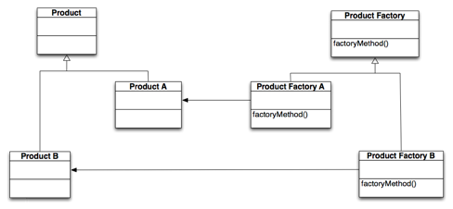
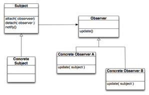

#Architecture and Design Patterns
## Part 1
The aim of this weeks workshop is to explore software architecture and its implementation in Rails. We will do this using a familiar example, the Point of Sale (POS) system from the UML workshops. Make sure you familiarise yourself with the class diagram from this workshop so that you are ready to go today.

Firstly, you should work in pairs to create a software architecture appropriate to the problem being solved. This may fit the Rails paradigm or it may not, but the point is to select an architecture appropriate for the problem. Then you will need to consider how your architecture fits the Rails paradigm, and perhaps make adjustments to your architecture in order to make full use of the Rails featureset.

### Theory - Architectural Patterns
#### Structural Decomposition Patterns

- Layered Architectural Pattern - Portable and maintainable with little or no interaction between the parts, and where the parts can be developed separately.
Function Oriented Pipelining Pattern - Portable and maintainable where streams of data need to be transformed from one stream to another.
- Client Server Pattern - Manage access to shared data and resources in a situation where a large number of distributed clients wish to access the data and resources.
- Model-View-Controller - Very similar to the client server architecture. It can also be used in a situations where you need to manage a large number of distributed clients wishing to access shared data and resources.

#### Control Decomposition Patterns
- Centralised Control - One module has overall control for the sequencing of operations and for decision making.
- Decentralised Control - There is no one key module that has responsibility for control. Subsystems are autonomous and independent but co-ordinate their actions to achieve the system goals.
- Event Based Control - Each sub-system can respond to externally generated events from other sub-systems or the system’s environment.

It is possible - *and often necessary* - to combine different patterns to create a good architecture. It is also often necessary to adapt, modify or add to an architectural pattern to meet non-functional requirements.
**The choice of final architecture often depends on the non-functional requirements!**

### Specifying Architectures
Start by choosing a combination of decomposition patterns - either structural or control patterns - and then describe the responsibilities of each module, the relationships between modules and the collaborations between modules. Once you have worked out the decomposition, responsibilities and relationships then you have an opportunity to test the coupling and cohesion between modules.

#### Specifying Interfaces
Interfaces consist of the names of the publicly available operations together with their inputs, outputs and exceptions. The operations can be described by:

- UML Class diagrams, or UML interface specifications;
- Interface Description Languages that are available in many programming languages; or simply
- The names of the operations, inputs, outputs and exceptions, for example,
    * set time of day   setTime( time : integer ): void
    * pre-condition:    time is a valid time
    * post-condition:  the clock must be reset to timeThe Point Of Sale (POS) System

Recall the Point of Sale System (POS). A timber and hardware store that sells different kinds of timber, paints and painting products, lights and household electrical products, plumbing and bathroom products and gardening products.

In this workshop, your task is to create an architecture for the system that includes:

- The Mobile Sales Terminal Network;
- The Security System; and
- The Databases for storing transactions, customers and products.

### Rules of POS Operation
- Store staff can walk around the store with mobile MST terminals. A staff member can complete sales of items without the need to go to a register or sales station provided that customers have credit cards or store cards.
- To complete a sale with a **credit card** the following sequence of steps must occur:
    * The item’s bar code is scanned.
    * The credit card is inserted into the machine and the card is validated against the credit agency for the card.
    * If the card is valid then the price of the item is charged to the card if enough credit remains in the card. If not the the sale will be **declined** and no further action is possible for this sale.
    * If the amount is accepted then the item’ is ‘released’ from the store by sending its bar code to the central monitoring system. Released items do not raise alarms when they pass through  an exit monitored by the security system.
- Store cards are discounted debit cards, that is, the card acts as a debit card but applies a 10% discount to all non-sale and non-discounted items.  The following sequence of steps must occur for a sale with a store card:
    * The item’s bar code is scanned.
    * The store card is inserted into the machine and the card is validated against the customer’s debit balance.
    * If the card balance is sufficient for the the item then the sale is made and the customer’s balance is adjusted according to the price of the item. If the customer’s balance is not sufficient then the sale will be declined and they can be directed to a cash register for combined case/card sales.
    * If the sale proceeds then item’ is ‘released’ from the store.
- The staff can also perform stock taking activities by using their MST’s. They do this by scanning bar-codes or stock numbers of items. Once an item is scanned the inventory is checked and updated automatically.
- If no bar-code or stock-number exists on the item then they can look up the item’s stock-numbers from a description of the item. The staff member must select the correct item in this case and once selected the number of item is automatically recorded and the inventory adjusted as in 4. above.
- Supervisors can used the mobile data terminals to check sales for a specific sales consultant, or to determine the price of an item if there is a discounting period.
- Card sales must be done reliably, that is, that there is a 99.9999% chance that the sale goes through without a failure.

### Exercise One - Core
Working in teams of 2 or 3, the aim is to develop a software architecture natural to the implementation of the POS system.

Lets start by thinking about the problem!
- Can you group the requirements into cohesive subsets?
- What are the non-functional requirements in the problem?
- What requirements - *functional or non-functional* - will have the biggest influence on the architecture?

Now think about the possible architectures!
- What is a natural decomposition pattern for the POS system
- What is a natural control pattern for the POS system?

Using a simple block diagram, sketch your architecture and assign responsibilities to the modules in your architecture. Discuss the reasons for your choices with the class. Discuss the ways in which your architecture can be translated into the Rails framework. Do you need to make any adjustments or changes to do this?

### Exercise Two - Core
Specify your Software Architecture using Component Diagrams

Now lets turn your simple block diagrams into UML component diagrams (you may wish to look here: (http://www.uml-diagrams.org/component-diagrams.html) for help with the notation). Your task is to specify the POS system using a UML component diagram.

Here are some questions to help you understand your architecture better.
- You will need to think carefully about the interfaces between components, the internal structure of components - for example, are there subsystems existing inside your components?
- Look at the solution to Workshop 4. Is there any data that needs to be shared between components?
- Do you have operations on the interfaces between components that send or receive the shared data?
- Which of your components communicate using messages and which communicate using method calls?
- Can you specify the format of messages that must be sent between components?

### Exercise Three - Core
Your existing architecture may or may not fit a structure that would work in a Rails Application, if it does, show how or if not, explain why not and show how it can be modified to suit.

## Part 2
### Theory - Design Patterns
What is a design pattern?
The architect Christopher Alexander says that
> “Each pattern describes a problem that occurs over and over again in our environment, and then describes the core of a solution to that problem, in such a way that you can use the solution a million times over without ever doing the same thing twice”.

Even though Alexander was talking about buildings and towns, the same is true of object oriented designs. In object oriented designs the solutions are expressed in terms of interfaces and objects but the ideas carry over.
The design patterns are the solutions to commonly occurring design problems that an be used a over and over.

Design patterns are built on the four general principles of good reusable object oriented design:

- The Open/Closed principle;
- The Liskov substitution principle;
- The principle of Delegation; and
- The principle of Programming to an Interface.

The factory method pattern and the observer pattern use these principles to develop good modifiable Object Oriented designs. Today the practice comes in applying these principles to the development of bank accounts. The objective for you is to see how these principles translate into good designs and good code!

### Exercise Four - Core
Lets start with a simple bank account. Write a Ruby class that defines a simple bank account with methods to initialize a bank account and to deposit and withdraw amounts of money. Of course, be careful not to allow anyone to withdraw more than they have.

Different accounts have different rules for managing that account. For example, a high interest term deposit accounts may yield a 5.6% interest rate for a 6 month term and a 5.75% interest rate for a 12 month term but the money cannot be withdrawn during the investment period, while a savings account may only yield 3.2% but can be withdrawn at call.

Using UML design a bank account class with an interest rate and a duration for a term. A duration of 0 is interpreted as being ‘at call’. Implement your solution in Ruby. Your solution must be open/closed!

### Exercise Five - Core
The factory method can be used to create different types of bank accounts. The class diagram for the factory method pattern is given in Figure 1.

>Figure 1 - The factory method.

Using UML class diagrams and UML sequence diagrams, design a bank account factory. Implement your bank account factory in Ruby.

### Exercise Six - Core
Once you have created your bank accounts and your bank account factory then we will need to observe the changes made to bank accounts. We would like customers to observe changes to their bank accounts but only when a customer requests to do so.

The class diagram for the observer pattern is given in Figure 2. Using the class diagram in Figure 2, design a customer class that is an observer of multiple bank accounts and an account class that can be observed by multiple customers.

>Figure 2 - The observer pattern
>Note that a customer may own and consequently observe many bank accounts, and that many customers may own a bank account.

### Exercise Seven - Core
Create a customer class in Ruby that is an observer of bank accounts, that is, implement a customer class so that whenever one customer changes their bank balance all other observers to of that account are aware of the change.
This is the push version of the observer.

How would you modify your bank account classes and your customer classes so that you implement a pull version of the observer? Implement your solution in Ruby.

## Workshop Submission
You are required to submit your answers to all of the exercises marked 'core' in this weeks workshop. You should submit one zip file, named 'workshop 4 - STUDENTNO.zip' where STUDENTNO is replaced by your student number. For example, if your student number was 12345, your file should be called `workshop 4 - 12345.zip`.

In this file you should include:

- A pdf document with your answers to exercise one, two, three and six.
- A ruby file called `bank_account.rb` with your bank account classes.
- A ruby file called `bank_factories.rb` with your bank account factories, this file should `require 'bank_account.rb'`
- A ruby file called `bank_customer.rb` which contains your account observers

The submission for this workshop is due at **11:59 pm, Sunday the 10th of May**.

