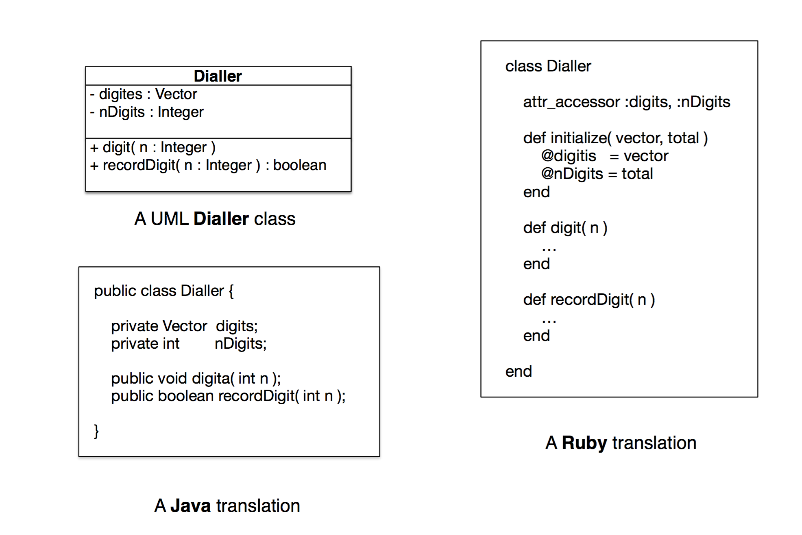
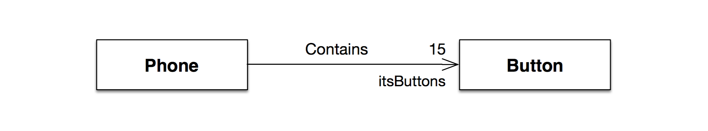
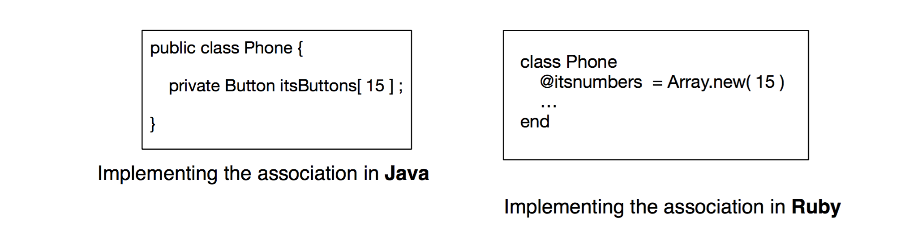
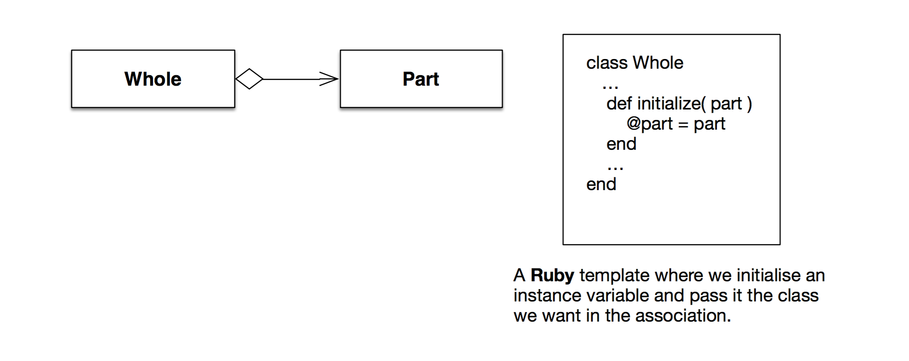
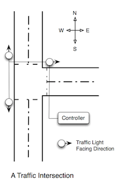

#UML To Code
## Part 1
The aim of these two workshops is to solidify your understanding of both UML and the fundamental ideas behind how we transform these diagrams to functioning programs. First we present some theory.

### Theory - Translating UML into programs
While the procedure of developing code from UML models is not automatic there are certainly guidelines that can help. Below we give a number of guidelines that should help you translate class models to object orient code, whether it's in Ruby or Java or some other object oriented language.

#### Classes
Classes are straightforward to translate, where the only real issue to deal with is in the multiplicities of the attributes. An example of how we might translate UML classes to code is given in Figure 1. The Java translation would need to add getters and setters for the two private variables.


> **Figure 1** A class and its translation to Ruby and Java

Translating attributes with multiplicities requires you to choose a data structure to hold the multiple values of the attribute. The same can be said for associations (see below).


#### Associations
Associations can be implemented through:
1. the attributes of the classes involved;
2. message passing;
3. remote procedure call.

We will focus on (1) in this subject. Consider the association shown in Figure 2.


> **Figure 2** An association between Phone objects and Button objects.

An implementation of an association uses the attributes of the classes to make the association. If the class at the opposite end plays a role in the association then it is common to name a variable , of the type of the other class, after its role. Note also that the association is directed from *Phone* to *Button* and so we only need implement the association in the *Phone* class.


> **Figure 3** An association and its translation to Ruby and Java

We do this in Figure 3 where we declare a variable it's Buttons of type *Button*. Notice also that we use an array with 15 elements because of the multiplicity in the association.

**Aggregation** and **composition** follow much the same pattern as general associations. Figure 4 gives one example of how aggregation can be implemented in Ruby.


> **Figure 4** An association and its translation to Ruby and Java

### Inheritance
Inheritance is perhaps the most common association that is implemented and usually has direct language support. The idea of inheritance is important in object oriented design because it permits us to design classes properly once and re-use that design often.


> **Figure 5** A demonstration of inheritence in java and ruby

### Recapping The POS
Recall the Point of Sale System (POS). A timber and hardware store that sells different kinds of timber, paints and painting products, lights and household electrical products, plumbing and bathroom products and gardening products.

In this workshop, your task is to take the class diagrams that you have created in workshop 4 and implement them in ruby. Below are the rules for your reference:

### Rules of POS Operation
- Store staff can walk around the store with mobile MST terminals. A staff member can complete sales of items without the need to go to a register or sales station provided that customers have credit cards or store cards.
- To complete a sale with a **credit card** the following sequence of steps must occur:
    * The item’s bar code is scanned.
    * The credit card is inserted into the machine and the card is validated against the credit agency for the card.
    * If the card is valid then the price of the item is charged to the card if enough credit remains in the card. If not the the sale will be **declined** and no further action is possible for this sale.
    * If the amount is accepted then the item’ is ‘released’ from the store by sending its bar code to the central monitoring system. Released items do not raise alarms when they pass through  an exit monitored by the security system.
- Store cards are discounted debit cards, that is, the card acts as a debit card but applies a 10% discount to all non-sale and non-discounted items.  The following sequence of steps must occur for a sale with a store card:
    * The item’s bar code is scanned.
    * The store card is inserted into the machine and the card is validated against the customer’s debit balance.
    * If the card balance is sufficient for the the item then the sale is made and the customer’s balance is adjusted according to the price of the item. If the customer’s balance is not sufficient then the sale will be declined and they can be directed to a cash register for combined case/card sales.
    * If the sale proceeds then item’ is ‘released’ from the store.
- The staff can also perform stock taking activities by using their MST’s. They do this by scanning bar-codes or stock numbers of items. Once an item is scanned the inventory is checked and updated automatically.
- If no bar-code or stock-number exists on the item then they can look up the item’s stock-numbers from a description of the item. The staff member must select the correct item in this case and once selected the number of item is automatically recorded and the inventory adjusted as in 4. above.
- Supervisors can used the mobile data terminals to check sales for a specific sales consultant, or to determine the price of an item if there is a discounting period.
- Card sales must be done reliably, that is, that there is a 99.9999% chance that the sale goes through without a failure.

### Exercise One - Core
Take the UML Diagrams you have developed for Workshop 3 and implement the class diagram in Ruby. Make sure that you test your program, using an environment like `irb` will help with this. As mentioned previously you can load a file into `irb` to test like so:
```ruby
load('example_file.rb')
```

## Part 2
This week we will look specifically at translating state machines into Ruby. We look, in particular, at the state machine for a traffic light system.

### The Traffic Lights
The control system must ensure the correct and safe functioning of a set of traffic lights at a T- junction between a major and a minor road. The major road runs North-South and the minor road runs East-West. Sensors are placed on the major road and in the minor road to detect traffic. The below figure demonstrates this arangement.



The aim is to assure that the lights on the major road allow traffic to flow freely on the major road. The starting state for the traffic lights is that the lights on the major road are Green and the lights on the minor road are Red. The lights are then changed according to the timings presented below.

If the N-S lights are Green and the lights ‘timeout’ then the lights are cycled. They do this in three steps:

1. The lights on the major road are changed to Amber for the period of time given in Table 1. When that time has elapsed the lights on the N-S major road are turned to red.
2. When the lights on the N-S major road have turned to Red the lights on the minor E-W road are turned to Green.
3. When the lights on the E-W minor road have timed out after the period of time given in Table 1, then the E-W lights turn to Amber for the time specified in the table and when that period has finished then they are turned to Red. When the E-W lights have turned Red then the lights on the major road are turned to Green.

##### Control System Timing

|       | North-South Road | East-West Road |
|:-----:|:----------------:|:--------------:|
|  Red  |    40 seconds    |   70 seconds   |
| Amber |     5 seconds    |    5 seconds   |
| Green |    70 seconds    |   40 seconds   |

### Exercise Two - Core
Using the information above, create a state machine diagram that encapsulates this requirements, include all states and state transitions (along with triggers).

### Exercise Three - Core
Taking the state machine that you have designed in exercise two, implement the traffic light system as a simulation in Ruby. Ensure that your system implements the state transitions in a safe manner.

Include, in your solution, a function to start your simulation that prints out each update step as it happens.

### Exercise Four - Extension
Extend your implementation from exercise three to a multithreaded approach that runs as a true concurrent, distributed system.

### Remaing Time
Feel free to use any remaining time in this workshop to work on your project implementation.

## Workshop Submission
You are required to submit your answers to all of the exercises marked 'core' in this weeks workshop. You should submit one zip file, named 'workshop 5 - STUDENTNO.zip' where STUDENTNO is replaced by your student number. For example, if your student number was 12345, your file should be called `workshop 5 - 12345.zip`.

In this file you should include:

- A ruby file for exercise one and three
- A pdf containing your state machine for exercise two

The submission for this workshop is due at **11:59 pm, Sunday the 24th of May**.


